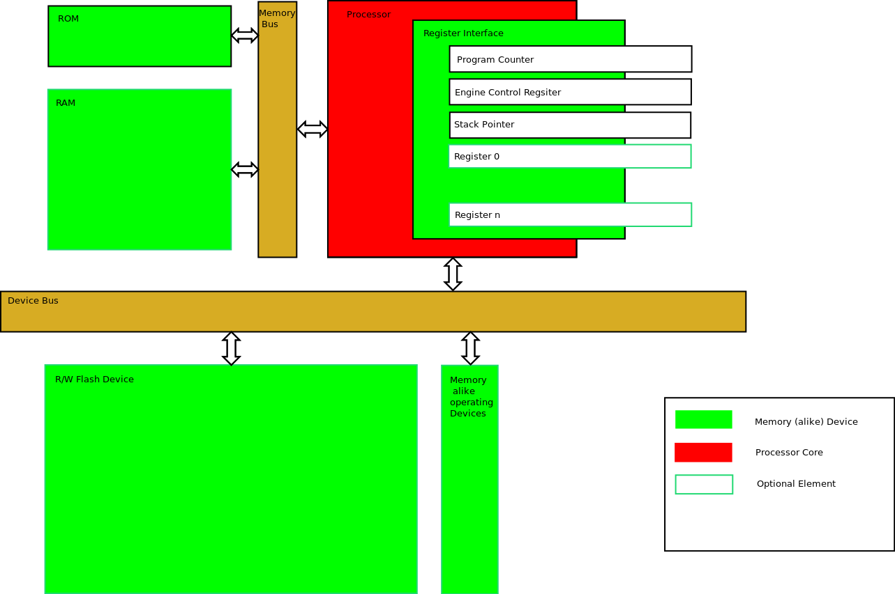
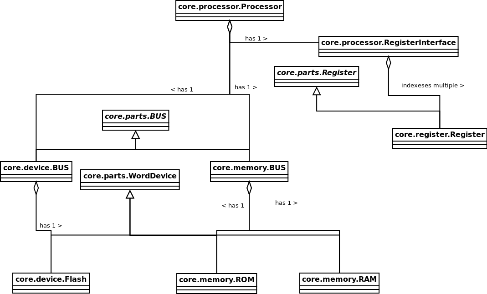

Overview
********

Block Diagram of the Architecture
=================================

Class Diagram of the Memory Layout
==================================

(UML Diagram)

Model Overview
==============

The model uses the following parts:

- Core: Everything the basic RM needs to work( Memory, Processor, Interrupts, abstract Commands)
  most probably you are not going to use this part.
- Commands: Here are a bunch of basic Commands. You should definitly check the doc for these modules.
- Machines: A bunch of ready to use RMs.
- engine_tools: A bunch of utils used by the Core module. If you do not want to modify the core
  you are not going to use this package.
- Tools: A set of tools to provide basic funtionality, like an Assembler.
- App: A collection of applications to provide a more comfortable interface to the RMs.

Usual users should take a look at the Commands, Machines, Tools and Apps. 
If you want to dive deep into PRM2 you should check out the core.processor documentation.
